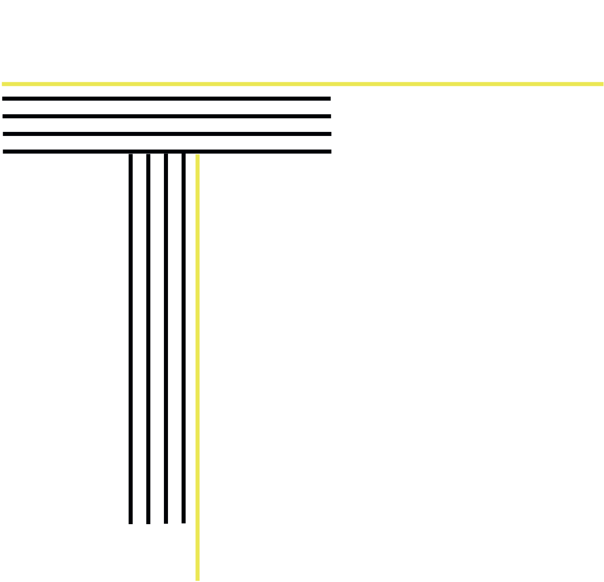

The letter is situated in the middle of the paper and on the left side. The vertical part consist of five lines and the last fifth line is yellow and longer downwards. The other lines are black. The upper part of the letter - the horizontal part is also consist of five lines and the last line at the top is yellow and is longer to the right part of the paper.
