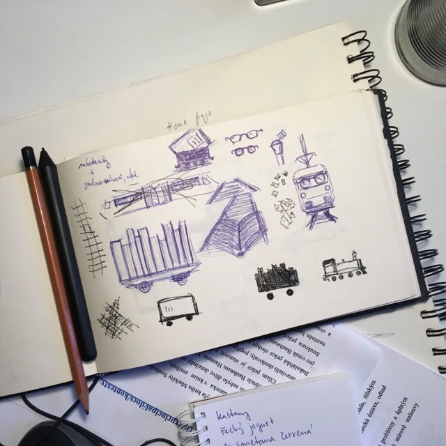
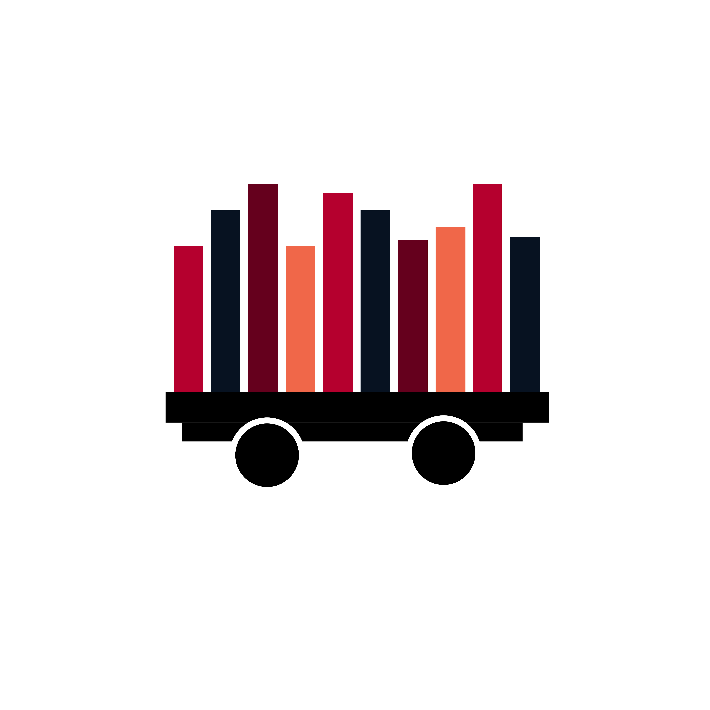
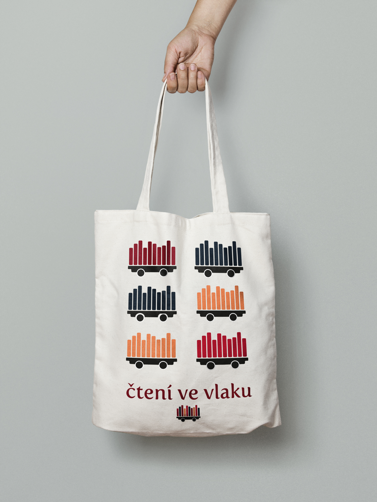
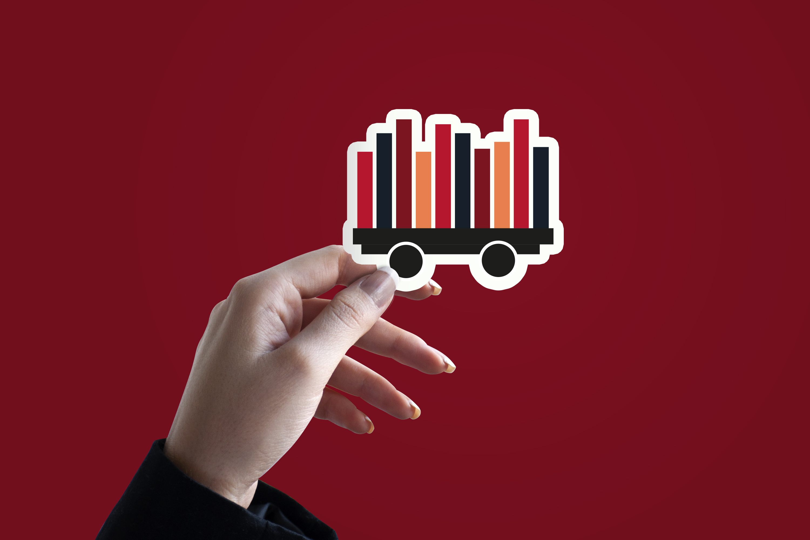

# Čtení ve vlaku. Campaign and visual style of literature festival.
## Introduction
“Čtení ve vlaku” is an annual festival where leading czech writers read from their books to passengers when they travel by train since 2013. Which takes place at the trains of suburban railway lines of Prague.
## Research
In the first place we found out how the previous year of the festival looked because we couldn't find any such thing as this festival. (I still think there isn't.) Then we made research about other literature festivals in Europe.

## How did we work on the project?
We worked on the project as a team. Michal and Tereza took care of graphic design, Michaela and Klára had marketing at work, Božena management and Irena PR. We started in October, when everyone found out about the festival. At first we all thought about the strategy, then Michal and Tereza started working on the logo. Michal drew logo designs ideas on paper, we chose the best together and Tereza created it on the computer in Adobe Illustrator.

### Klára and Irena with cakes before the presentation to the client :) 

### First proposals

## About the logo
The logo forms a train symbol. We placed books on the wagon, which symbolize the book festival on the train. The logo is made of dark autumn colors, because the festival is usually in autumn. Of course, we also made a black and white variant of the logo. We also used the logo as a design for bags or badges.

## Gallery

